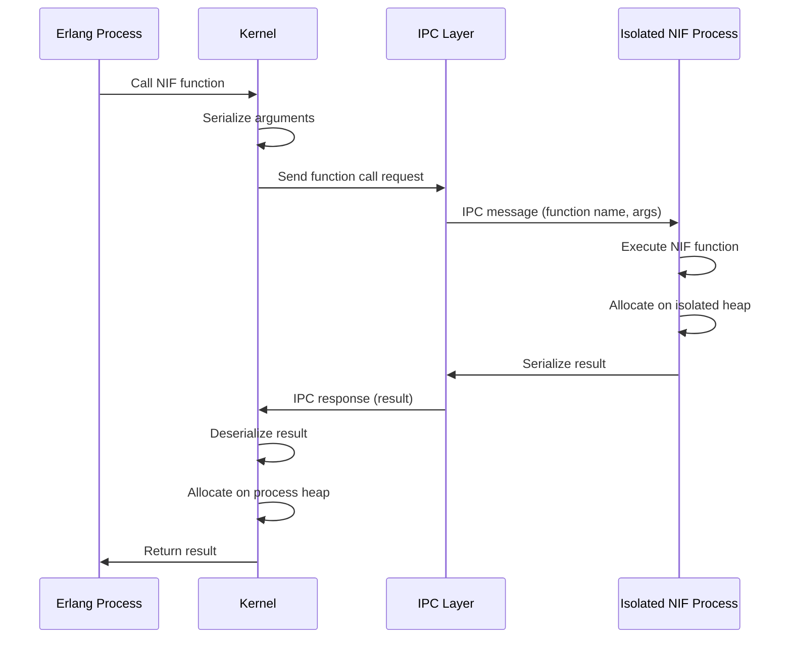
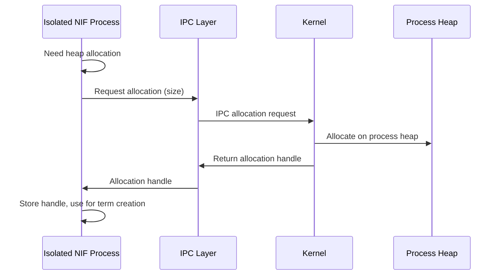

# Design A: Primary DriverKit Approach

## Overview

Design A follows the System Extensions/DriverKit pattern with full user-space driver execution and complete memory isolation. NIF libraries are loaded as isolated user-space processes (similar to DriverKit dexts) with separate memory spaces, communicating with the kernel via IPC.

## Architecture Description

### Core Principles

1. **User-Space Execution**: NIF libraries execute in separate user-space processes, not in the kernel address space
2. **Memory Isolation**: Each NIF library has its own separate stack and heap, isolated from kernel and other libraries
3. **IPC Communication**: All communication between kernel and NIF libraries occurs via Inter-Process Communication (IPC)
4. **Kernel Loading**: Kernel loads NIF libraries into isolated processes but maintains control over lifecycle
5. **Not Independent Apps**: NIF libraries are not independent applications; they are managed extensions of the kernel

### Architecture Components

#### 1. NIF Isolation Manager

**Purpose**: Manages isolated NIF processes, similar to how macOS manages System Extensions

**Responsibilities**:
- Create isolated process for each NIF library
- Manage process lifecycle (start, stop, restart)
- Enforce memory isolation boundaries
- Monitor isolated processes for crashes

**Location**: New component in `infrastructure/infrastructure_nif_isolation/`

#### 2. NIF IPC Protocol

**Purpose**: Communication protocol between kernel and isolated NIF processes

**Responsibilities**:
- Serialize/deserialize Erlang terms for IPC transfer
- Handle function call requests from kernel to NIF
- Handle function responses from NIF to kernel
- Manage heap allocation requests/responses
- Handle error propagation

**Location**: New component in `infrastructure/infrastructure_nif_ipc/`

#### 3. Isolated NIF Process

**Purpose**: User-space process that executes NIF library code

**Components**:
- **NIF Library Loader**: Loads NIF library into isolated process
- **IPC Server**: Receives requests from kernel, executes NIF functions
- **Isolated Heap**: Separate heap for NIF allocations
- **Isolated Stack**: Separate stack for NIF execution

**Location**: New component in `infrastructure/infrastructure_nif_process/`

#### 4. Kernel NIF Proxy

**Purpose**: Kernel-side proxy that communicates with isolated NIF processes

**Responsibilities**:
- Maintain registry of isolated NIF processes
- Route NIF function calls to appropriate isolated process
- Serialize process state for IPC transfer
- Handle IPC errors and timeouts

**Location**: Modified `adapters/adapters_nifs/src/nif_loader.rs`

## Memory Isolation Mechanisms

### 1. Separate Process Per Library

Each NIF library runs in its own isolated process with:
- **Separate Address Space**: Complete memory isolation from kernel
- **Separate Heap**: Isolated heap for NIF allocations
- **Separate Stack**: Isolated stack for NIF execution
- **Process Boundaries**: OS-level process isolation

### 2. IPC-Based Memory Access

NIFs cannot directly access kernel memory. Instead:
- **Heap Allocation**: NIF requests heap allocation via IPC, kernel allocates and returns handle
- **Heap Access**: NIF receives serialized heap data via IPC
- **Process State**: NIF receives serialized process state, not direct access

### 3. Sandboxing

Isolated NIF processes are sandboxed:
- **No Direct System Access**: Cannot access file system, network, etc. without kernel permission
- **Limited System Calls**: Only IPC-related system calls allowed
- **Resource Limits**: CPU, memory limits enforced by kernel

## Kernel Loading Mechanism

### Loading Process

1. **Library Compilation**: NIF library compiled as dynamic library (.so, .dylib, .dll)
2. **Isolation Metadata**: Library includes isolation metadata (required resources, permissions)
3. **Process Creation**: Kernel creates isolated process for library
4. **Library Loading**: Isolated process loads library into its address space
5. **Registration**: Isolated process registers with kernel via IPC
6. **Function Discovery**: Kernel discovers NIF functions via IPC metadata exchange

### Process Lifecycle

- **Start**: Kernel spawns isolated process, process loads library
- **Stop**: Kernel sends shutdown signal, process unloads library and exits
- **Restart**: Kernel can restart crashed isolated processes
- **Monitoring**: Kernel monitors process health via heartbeat IPC

## Communication Protocol

### Function Call Flow

### Heap Allocation Flow

## Design Characteristics

### Memory Isolation

- **Complete Isolation**: Each NIF library has separate address space
- **No Shared Memory**: No direct memory sharing between kernel and NIFs
- **IPC-Only Access**: All memory access via IPC serialization

### Security

- **Process Boundaries**: OS-level security boundaries
- **Sandboxing**: Limited system access for isolated processes
- **Crash Isolation**: NIF crashes don't affect kernel
- **Resource Limits**: CPU and memory limits enforced

### Performance

- **IPC Overhead**: Function calls require IPC serialization/deserialization
- **Context Switching**: Process context switches for each NIF call
- **Memory Overhead**: Separate process per library (stack, heap, OS structures)

### Migration Complexity

- **High Complexity**: Requires complete IPC protocol design
- **Major Refactoring**: NIF API must be redesigned for IPC
- **Process Management**: New infrastructure for process lifecycle
- **Serialization**: All data must be serializable for IPC

## Implementation Requirements

### New Components

1. **NIF Isolation Manager**: Process creation, lifecycle management
2. **NIF IPC Protocol**: Serialization, message passing, error handling
3. **Isolated NIF Process**: Process entry point, IPC server, library loader
4. **Kernel NIF Proxy**: IPC client, request routing, state management

### Modified Components

1. **NIF Loader**: Replace library loading with process creation
2. **NIF Environment**: Replace direct Process access with IPC client
3. **NIF API**: Replace direct heap access with IPC requests
4. **Process Struct**: Replace pointer storage with process identifiers

### Dependencies

- **IPC Framework**: Message passing library (e.g., Unix domain sockets, shared memory)
- **Serialization**: Efficient serialization for Erlang terms (e.g., EI format)
- **Process Management**: Process spawning, monitoring, lifecycle management

## Advantages

1. **Maximum Security**: Complete memory isolation prevents NIF corruption
2. **Crash Isolation**: NIF crashes don't affect kernel stability
3. **Resource Control**: Per-library resource limits and monitoring
4. **DriverKit Alignment**: Follows established DriverKit patterns

## Disadvantages

1. **Performance Overhead**: IPC and serialization add latency
2. **Memory Overhead**: Separate process per library increases memory usage
3. **Complexity**: Significant infrastructure required
4. **Migration Effort**: Major refactoring of existing NIF code

## Assumptions

1. **OS Support**: Assumes OS supports process isolation and IPC mechanisms
2. **Serialization Performance**: Assumes efficient serialization is feasible
3. **IPC Latency**: Assumes IPC latency is acceptable for NIF use cases
4. **Process Management**: Assumes kernel can efficiently manage multiple isolated processes

