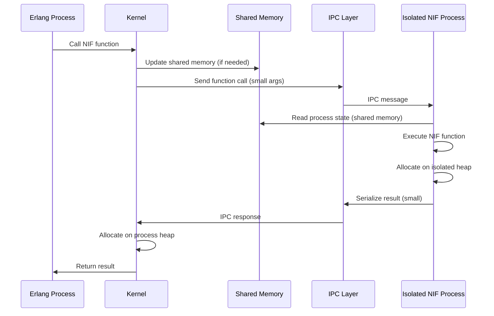
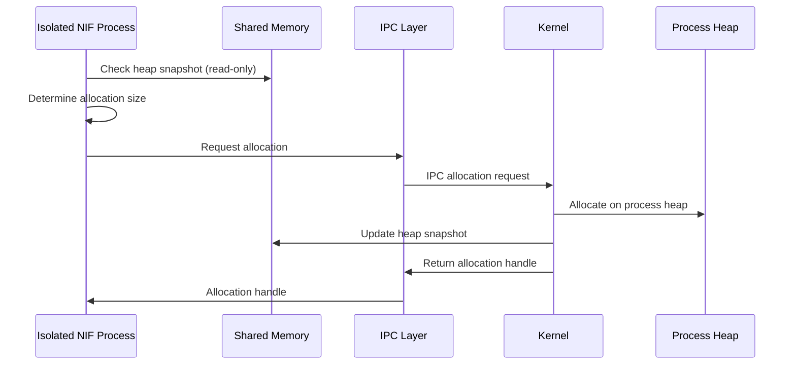

# Design B: Hybrid Isolation Model

## Overview

Design B provides a hybrid model with partial isolation. NIF libraries run in isolated processes but share some memory regions with the kernel for performance. This balances security isolation with performance requirements.

## Architecture Description

### Core Principles

1. **Hybrid Execution**: NIF libraries execute in isolated processes but share read-only memory regions
2. **Partial Isolation**: Critical memory (heap, stack) is isolated, but read-only data can be shared
3. **Selective IPC**: Performance-critical operations use shared memory, others use IPC
4. **Kernel Control**: Kernel maintains control over shared memory regions
5. **Gradual Migration**: Allows incremental migration from current architecture

### Architecture Components

#### 1. Hybrid Isolation Manager

**Purpose**: Manages isolated NIF processes with shared memory regions

**Responsibilities**:
- Create isolated processes with shared memory mappings
- Manage shared memory regions (read-only process state, read-only heap snapshots)
- Enforce memory protection (read-only shared regions)
- Monitor isolated processes

**Location**: New component in `infrastructure/infrastructure_nif_hybrid/`

#### 2. Shared Memory Manager

**Purpose**: Manages shared memory regions between kernel and isolated NIF processes

**Responsibilities**:
- Create shared memory regions for read-only data
- Map shared memory into isolated processes
- Enforce read-only protection
- Synchronize shared memory updates

**Location**: New component in `infrastructure/infrastructure_nif_shared_memory/`

#### 3. Hybrid IPC Protocol

**Purpose**: Communication protocol with shared memory optimization

**Responsibilities**:
- Use shared memory for large read-only data transfers
- Use IPC for function calls and write operations
- Optimize serialization using shared memory references
- Handle both IPC and shared memory access patterns

**Location**: New component in `infrastructure/infrastructure_nif_hybrid_ipc/`

#### 4. Isolated NIF Process (Hybrid)

**Purpose**: Isolated process with shared memory access

**Components**:
- **NIF Library Loader**: Loads NIF library into isolated process
- **Shared Memory Client**: Accesses read-only shared memory regions
- **IPC Server**: Handles function calls and write operations
- **Isolated Heap**: Separate heap for NIF allocations (write operations)
- **Isolated Stack**: Separate stack for NIF execution

**Location**: Modified `infrastructure/infrastructure_nif_process/`

#### 5. Kernel NIF Proxy (Hybrid)

**Purpose**: Kernel-side proxy with shared memory management

**Responsibilities**:
- Maintain registry of isolated NIF processes
- Manage shared memory regions
- Route function calls (IPC for writes, shared memory for reads)
- Synchronize shared memory updates

**Location**: Modified `adapters/adapters_nifs/src/nif_loader.rs`

## Memory Isolation Mechanisms

### 1. Isolated Process with Shared Memory

Each NIF library runs in isolated process with:
- **Isolated Heap**: Separate heap for NIF write allocations
- **Isolated Stack**: Separate stack for NIF execution
- **Shared Read-Only Memory**: Read-only access to process state, heap snapshots
- **Process Boundaries**: OS-level isolation for write operations

### 2. Shared Memory Regions

Kernel creates shared memory regions:
- **Process State Snapshot**: Read-only snapshot of Process struct (updated periodically)
- **Heap Snapshot**: Read-only snapshot of process heap (updated on GC or periodically)
- **Read-Only Data**: Immutable Erlang terms, atom table, etc.

### 3. Hybrid Access Pattern

NIFs use different access methods:
- **Read Operations**: Access shared memory directly (no IPC overhead)
- **Write Operations**: Request via IPC, kernel performs write
- **Heap Allocation**: Request via IPC, kernel allocates and updates shared memory

## Kernel Loading Mechanism

### Loading Process

1. **Library Compilation**: NIF library compiled as dynamic library
2. **Isolation Metadata**: Library includes isolation and shared memory requirements
3. **Shared Memory Creation**: Kernel creates shared memory regions
4. **Process Creation**: Kernel creates isolated process with shared memory mappings
5. **Library Loading**: Isolated process loads library
6. **Registration**: Process registers with kernel, receives shared memory handles
7. **Function Discovery**: Kernel discovers functions via IPC metadata exchange

### Shared Memory Lifecycle

- **Creation**: Kernel creates shared memory regions on NIF load
- **Mapping**: Isolated process maps shared memory as read-only
- **Updates**: Kernel updates shared memory periodically or on events
- **Cleanup**: Shared memory destroyed when NIF unloaded

## Communication Protocol

### Function Call Flow (Read-Heavy)

### Heap Allocation Flow (Hybrid)

## Design Characteristics

### Memory Isolation

- **Partial Isolation**: Critical writes isolated, reads can use shared memory
- **Selective Sharing**: Only read-only data shared, writes isolated
- **Protection**: Shared memory regions are read-only in NIF processes

### Security

- **Write Isolation**: All writes go through kernel, preventing corruption
- **Read Sharing**: Read-only sharing reduces IPC overhead
- **Process Boundaries**: OS-level isolation for write operations
- **Crash Isolation**: NIF crashes don't affect kernel (isolated process)

### Performance

- **Reduced IPC**: Read operations use shared memory (no serialization)
- **Write IPC**: Write operations still require IPC
- **Memory Overhead**: Shared memory + isolated process overhead
- **Synchronization**: Periodic shared memory updates required

### Migration Complexity

- **Medium-High Complexity**: Requires shared memory management
- **Moderate Refactoring**: NIF API needs hybrid access patterns
- **Process Management**: Isolated process management required
- **Selective Serialization**: Only writes need serialization

## Implementation Requirements

### New Components

1. **Hybrid Isolation Manager**: Process + shared memory management
2. **Shared Memory Manager**: Shared memory creation, mapping, updates
3. **Hybrid IPC Protocol**: IPC + shared memory access patterns
4. **Isolated NIF Process (Hybrid)**: Process with shared memory client

### Modified Components

1. **NIF Loader**: Replace with hybrid loading (process + shared memory)
2. **NIF Environment**: Hybrid access (shared memory reads, IPC writes)
3. **NIF API**: Optimize for read-heavy operations using shared memory
4. **Process Struct**: Add shared memory snapshot generation

### Dependencies

- **Shared Memory**: OS shared memory mechanisms (mmap, shm_open)
- **IPC Framework**: Message passing for write operations
- **Serialization**: Efficient serialization for write operations only
- **Process Management**: Process spawning and lifecycle management

## Advantages

1. **Performance**: Read operations avoid IPC overhead
2. **Security**: Write operations isolated, preventing corruption
3. **Gradual Migration**: Can migrate incrementally from current architecture
4. **Balanced**: Good balance between security and performance

## Disadvantages

1. **Complexity**: Shared memory management adds complexity
2. **Synchronization**: Shared memory updates require synchronization
3. **Memory Overhead**: Shared memory + isolated process overhead
4. **Partial Isolation**: Not as secure as full isolation

## Assumptions

1. **Read-Heavy Workloads**: Assumes NIFs are read-heavy (benefits from shared memory)
2. **OS Support**: Assumes OS supports shared memory and process isolation
3. **Synchronization**: Assumes periodic shared memory updates are acceptable
4. **Migration Path**: Assumes incremental migration is feasible

