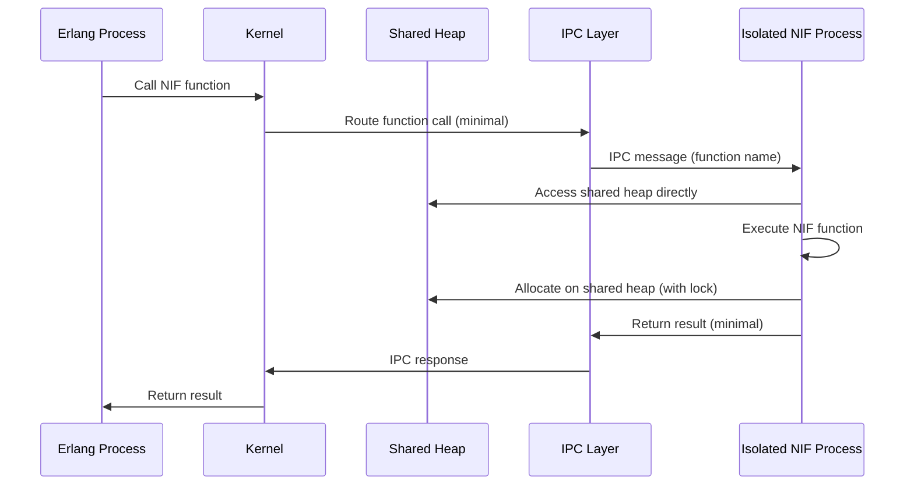
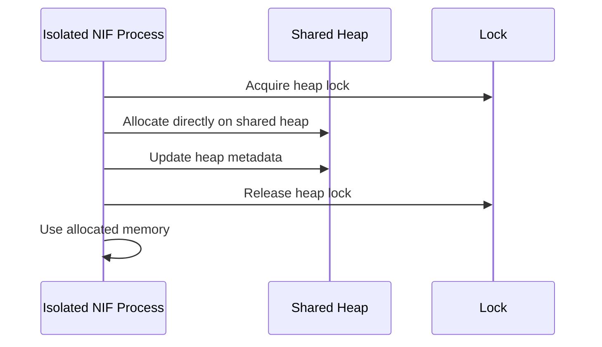

# Design C: Minimal Isolation with Maximum Compatibility

## Overview

Design C provides minimal isolation with maximum compatibility with the current architecture. NIF libraries run in isolated processes but maintain near-direct memory access through carefully controlled shared memory regions. This minimizes migration effort while providing basic isolation.

## Architecture Description

### Core Principles

1. **Minimal Isolation**: Isolated processes with extensive shared memory for compatibility
2. **Maximum Compatibility**: Maintains similar memory access patterns as current architecture
3. **Selective Isolation**: Only critical operations (function calls) go through IPC
4. **Shared Heap Access**: NIFs can directly access process heap via shared memory
5. **Easy Migration**: Minimal changes required to existing NIF code

### Architecture Components

#### 1. Minimal Isolation Manager

**Purpose**: Manages isolated NIF processes with extensive shared memory

**Responsibilities**:
- Create isolated processes with shared heap mappings
- Manage shared memory regions (heap, process state)
- Enforce minimal isolation boundaries
- Provide compatibility layer for existing NIF code

**Location**: New component in `infrastructure/infrastructure_nif_minimal/`

#### 2. Shared Heap Manager

**Purpose**: Manages shared heap between kernel and isolated NIF processes

**Responsibilities**:
- Create shared heap region mapped into isolated processes
- Synchronize heap access (locks, atomic operations)
- Handle heap growth and reallocation
- Provide heap access API similar to current NifEnv

**Location**: New component in `infrastructure/infrastructure_nif_shared_heap/`

#### 3. Compatibility IPC Protocol

**Purpose**: Minimal IPC for function call routing only

**Responsibilities**:
- Route function calls from kernel to isolated NIF process
- Return function results
- Handle errors and exceptions
- Minimal serialization (function names, basic args)

**Location**: New component in `infrastructure/infrastructure_nif_compat_ipc/`

#### 4. Isolated NIF Process (Compatibility)

**Purpose**: Isolated process with shared heap access

**Components**:
- **NIF Library Loader**: Loads NIF library into isolated process
- **Shared Heap Client**: Direct access to shared process heap
- **IPC Server**: Minimal IPC for function call routing
- **Compatibility NifEnv**: NifEnv-like API using shared heap

**Location**: Modified `infrastructure/infrastructure_nif_process/`

#### 5. Kernel NIF Proxy (Compatibility)

**Purpose**: Kernel-side proxy with shared heap management

**Responsibilities**:
- Maintain registry of isolated NIF processes
- Manage shared heap regions
- Route function calls via minimal IPC
- Provide compatibility layer

**Location**: Modified `adapters/adapters_nifs/src/nif_loader.rs`

## Memory Isolation Mechanisms

### 1. Isolated Process with Shared Heap

Each NIF library runs in isolated process with:
- **Shared Heap**: Direct access to process heap via shared memory
- **Isolated Stack**: Separate stack for NIF execution (minimal isolation)
- **Shared Process State**: Direct access to Process struct via shared memory
- **Process Boundaries**: OS-level isolation for crash protection only

### 2. Shared Memory Regions

Kernel creates extensive shared memory:
- **Process Heap**: Entire process heap shared with NIF processes
- **Process Struct**: Process struct shared (with synchronization)
- **Atom Table**: Shared atom table for compatibility
- **Read-Write Access**: NIFs can read and write shared memory (with locks)

### 3. Minimal IPC

IPC used only for:
- **Function Call Routing**: Route calls from kernel to NIF process
- **Error Handling**: Propagate errors and exceptions
- **Lifecycle Management**: Start, stop, restart NIF processes

## Kernel Loading Mechanism

### Loading Process

1. **Library Compilation**: NIF library compiled as dynamic library
2. **Compatibility Metadata**: Library includes minimal isolation requirements
3. **Shared Heap Creation**: Kernel creates shared heap region
4. **Process Creation**: Kernel creates isolated process with shared heap mapping
5. **Library Loading**: Isolated process loads library
6. **Registration**: Process registers with kernel, receives shared heap handle
7. **Function Discovery**: Kernel discovers functions via minimal IPC

### Shared Heap Lifecycle

- **Creation**: Kernel creates shared heap on NIF load
- **Mapping**: Isolated process maps shared heap as read-write
- **Synchronization**: Heap access synchronized via locks/atomics
- **Cleanup**: Shared heap destroyed when NIF unloaded

## Communication Protocol

### Function Call Flow (Minimal IPC)

### Heap Allocation Flow (Shared Heap)

## Design Characteristics

### Memory Isolation

- **Minimal Isolation**: Only process boundaries, extensive shared memory
- **Shared Heap**: Direct heap access via shared memory
- **Synchronization**: Locks/atomics for heap access synchronization
- **Crash Protection**: Process boundaries prevent crash propagation

### Security

- **Crash Isolation**: NIF crashes don't affect kernel (isolated process)
- **Limited Isolation**: Memory corruption possible in shared regions
- **Synchronization**: Heap access synchronized to prevent races
- **Process Boundaries**: OS-level boundaries for crash protection

### Performance

- **Near-Direct Access**: Shared heap access similar to current architecture
- **Minimal IPC**: Only function call routing uses IPC
- **Lock Overhead**: Heap synchronization adds some overhead
- **Memory Overhead**: Shared memory + isolated process overhead

### Migration Complexity

- **Low Complexity**: Minimal changes to existing NIF code
- **Compatibility Layer**: NifEnv-like API maintains compatibility
- **Shared Memory**: Shared heap management required
- **Synchronization**: Heap access synchronization needed

## Implementation Requirements

### New Components

1. **Minimal Isolation Manager**: Process + shared heap management
2. **Shared Heap Manager**: Shared heap creation, mapping, synchronization
3. **Compatibility IPC Protocol**: Minimal IPC for function routing
4. **Isolated NIF Process (Compatibility)**: Process with shared heap access

### Modified Components

1. **NIF Loader**: Replace with minimal isolation loading (process + shared heap)
2. **NIF Environment**: Compatibility layer using shared heap
3. **NIF API**: Minimal changes, use shared heap instead of direct access
4. **Process Struct**: Add shared heap synchronization

### Dependencies

- **Shared Memory**: OS shared memory with read-write access
- **Synchronization**: Locks/atomics for heap access
- **Minimal IPC**: Lightweight IPC for function routing
- **Process Management**: Process spawning and lifecycle management

## Advantages

1. **Easy Migration**: Minimal changes to existing NIF code
2. **Performance**: Near-direct heap access maintains performance
3. **Compatibility**: Maintains similar memory access patterns
4. **Crash Protection**: Process boundaries prevent crash propagation

## Disadvantages

1. **Limited Security**: Memory corruption still possible in shared regions
2. **Synchronization Overhead**: Heap access requires locks
3. **Memory Overhead**: Shared memory + isolated process overhead
4. **Partial Isolation**: Not as secure as full isolation

## Assumptions

1. **Compatibility Priority**: Assumes compatibility is more important than security
2. **Synchronization**: Assumes lock-based heap synchronization is acceptable
3. **OS Support**: Assumes OS supports shared memory with read-write access
4. **Migration Effort**: Assumes minimal migration effort is required

